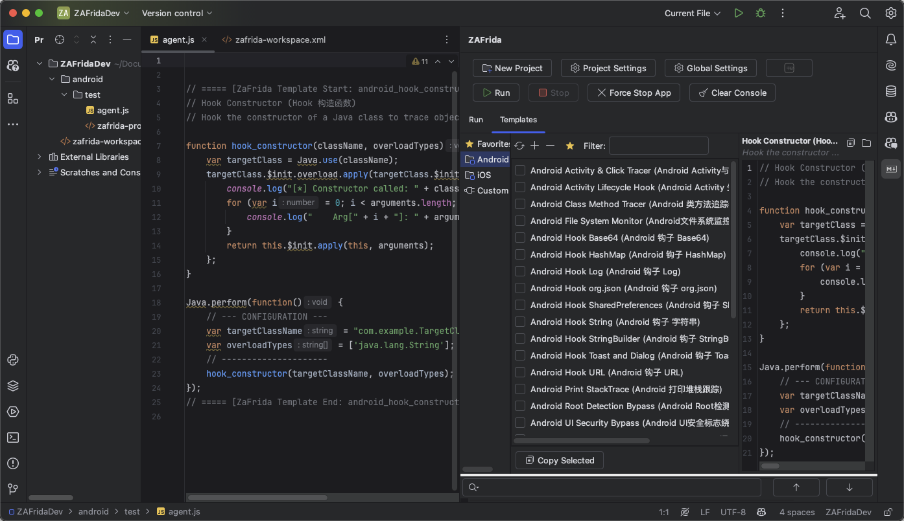
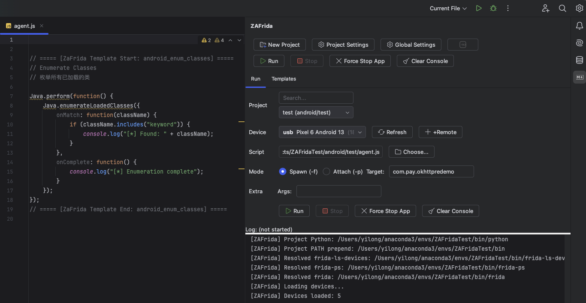
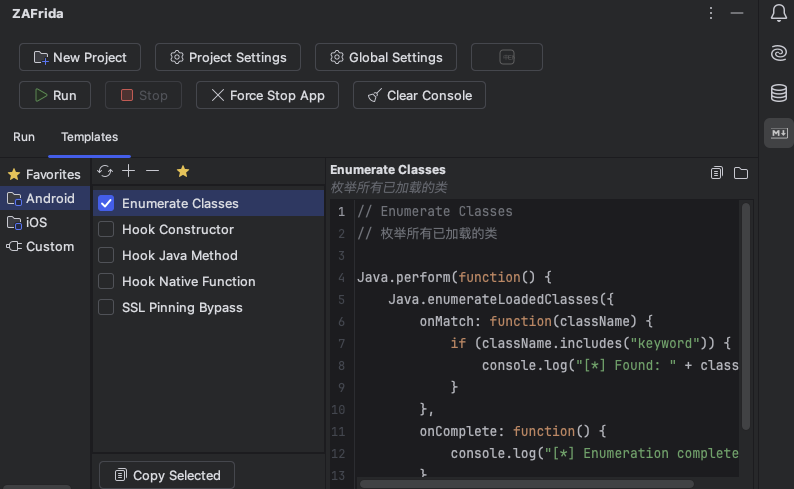
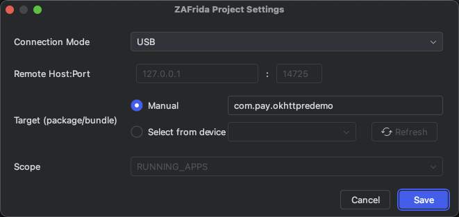
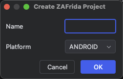

[中文](./README.md) | English

ZAFrida UI - PyCharm Frida Plugin
===============

Current Version: 0.3.7

Project Introduction
-----------------------------------

<h3 align="center">Frida GUI Tool for PyCharm/IntelliJ</h3>

ZAFrida UI is a Frida graphical interface plugin integrated into PyCharm and JetBrains IDEs. It aims to solve the complexity of Frida command-line operations and script management by providing a complete **UI interaction interface** to manage devices, processes, scripts, and logs.

The core highlight is its **"Checkbox-style" Template Management System**: users can dynamically insert code snippets into the main script or comment them out simply by checking/unchecking boxes, enabling a "block-building" style of Hook script assembly. Additionally, the plugin features built-in **Project Management** (`zafrida-project.xml`), supporting quick switching between multiple devices and environment configurations.

ZAFrida does not replace Frida but serves as a powerful UI wrapper for `frida-tools`, seamlessly connecting with your existing Python and Frida environment.

**Simplified Wiki**: [ZAFrida UI Simplified Wiki (BBS)](./zafrida_ui_wiki_bbs_en.md) (This is a simpler wiki)
**Full Wiki**: [ZAFrida UI Wiki (EN)](./ZAFridaUI_Wiki_en.md)

## Home

Quick Start
-----------------------------------

1.  **Install Plugin**: Search for "ZAFrida" in the IDE Plugin Marketplace or install via disk.
2.  **Configure the Default Environment**: ZAFrida uses the current PyCharm project interpreter by default. Global `Settings` -> `Tools` -> `ZAFrida` keeps only the default tool names/paths.
3.  **Create Project**: Right-click in Project View -> `New Frida Project`.
    * If this project needs a different Frida version, open ZAFrida `Project Settings`, select a Python interpreter or environment directory, and click `Test`.
4.  **Write/Select Script**: Select your `agent.js` or `agent.ts` in the Run Panel.
5.  **Hook & Debug**:
    * Connect device (USB or Remote).
    * Select target process or package name.
    * Click **Run**.
6.  **Use Templates**: Switch to the `Templates` tab, check the Hook functions you need (e.g., "SSL Pinning Bypass"), and the code will be automatically injected into your script.
7.  **Skills Automation (Optional)**: Disabled by default. Go to `Settings/Preferences -> ZAFrida -> Skills HTTP API`, check `Enable Skills` to auto-start the local API (or use manual `Start/Stop`). CLI and template locations:
    * Skill and canonical CLI: `skills-template/zafrida-http-control/`
    * Legacy-path compatibility launcher: `skills-cli/zafrida_skill_cli.py`

Features
-----------------------------------

* **Device & Process Management**  
  Integrated with `frida-ls-devices` and `frida-ps`, supporting one-click device refresh and viewing running processes, apps, or installed packages.

* **Multiple Connection Modes**  
  Full support for **USB**, **Remote**, and **Gadget** modes, with customizable remote host and port—no need to manually construct complex CLI arguments.

* **Interactive Script Execution (Run / Attach)**
    * Supports **Run (default Spawn)** and **Attach** as explicit execution actions rather than a simple mode switch.
    * Supports **Force Stop** to terminate target applications.
    * Built-in console output with automatic log persistence to the `zafrida-logs/` directory.

* **JavaScript / TypeScript Editor Context Menu (Important)**
    * Right-click inside a Frida `.js` or `.ts` editor to directly choose:
        * **Run Frida Script** – run the current file as the main script (default Spawn).
        * **Attach Frida Script** – attach the current file to an already running target process.
    * The file is automatically saved before execution, and the corresponding ZAFrida Project is auto-selected.
    * Ideal for quick PoC validation, demos, Gadget mode, or attaching to live processes.
    * **Shortcut**:
        * Windows / Linux: `Ctrl + Alt + S`
        * macOS: `⌘ + ⌥ + S`

* **Editor Snippets Insertion**
    * Provides **ZAFrida Frida Snippets** in JavaScript and TypeScript editors.
    * One-click insertion of common Frida code patterns, including:
        * `Java.perform` wrappers
        * Java method hook templates
        * Native hooks via `Interceptor.attach`
        * Module / export enumeration
        * `send()` log helpers
    * Insertions are performed via WriteCommandAction, fully undo/redo safe.

* **Dynamic Template System (Core Innovation)**
    * Built-in Android / iOS hook templates (e.g., SSL Pinning Bypass, Method Hook, Native Hook).
    * **Checkbox-driven control**: check to insert code, uncheck to automatically comment it out—no manual deletion required.
    * Supports custom templates with real-time preview inside the IDE.

* **Run Script + Attach Script Separation**
    * Supports a primary **Run Script** and an independent **Attach Script**.
    * Enables clean separation between startup hooks and runtime injection logic for advanced debugging workflows.

* **Project-Based Configuration (ZAFrida Project)**
    * Introduces the ZAFrida Project concept to persist devices, targets, scripts, attach scripts, and connection parameters as a complete working context.
    * In the Project View, supports:
        * `New Frida Project`
        * `Select Frida Project`
        * `Load Frida Project`
    * UI state and configuration are automatically restored when switching projects.

* **Smart Python / Frida Environment Resolution**
    * Uses the current PyCharm project SDK by default; each ZAFrida Project can override it with an interpreter or environment directory.
    * Supports local system/pyenv, venv/virtualenv, Conda, uv, Poetry, Pipenv, and Hatch environments.
    * Multiple ZAFrida Projects can share one environment path without copying the venv, making separate Frida 16/17 environments practical.
    * Missing `frida-tools` in either the current IDE environment or an explicit project environment fails clearly instead of silently using another version from system PATH; `Test` reports the effective Frida version.
    * Remote SSH, Docker, Docker Compose, and WSL interpreters cannot currently back a local Frida process.

* **Frida 17 / TypeScript**
    * File selection, editor Run/Attach, and snippets support `.js` and `.ts`; Frida 17's REPL automatically compiles `-l agent.ts`.
    * Bundled templates use the modern Module/NativePointer APIs required by Frida 17 while remaining suitable for common Frida 16 environments.
    * The frida-tools REPL bundles the standard Java/ObjC bridges for compatibility; npm or third-party module imports should use `frida-create -t agent` or an equivalent project.

* **Skills Local Automation API**
    * The opt-in loopback API exposes capabilities, projects/Python environments, devices/processes, Run/Attach, historical logs, and cursor-based incremental log reads.
    * The Skill adds bounded `wait-device` / `wait-session` recovery and distinguishes safe reads from side-effecting operations that must not be replayed automatically.
    * How to enable: `Settings/Preferences -> ZAFrida -> Skills HTTP API`, then check `Enable Skills`.
    * Bundled CLI and template:
        * `skills-template/zafrida-http-control/` (canonical Skill and CLI)
        * `skills-cli/zafrida_skill_cli.py` (legacy-path compatibility launcher)

Use Cases
-----------------------------------
ZAFrida UI is suitable for all scenarios involving reverse engineering with Frida, especially:
* Android / iOS App penetration testing and reverse analysis.
* Debugging processes requiring frequent switching of different Hook scripts.
* Engineers accustomed to using IDEs (PyCharm/IDEA) for mixed Python, JavaScript, and TypeScript development.

Technical Documentation
-----------------------------------

- **Requirements**:
    - IntelliJ IDEA or PyCharm (Recommended 2024.3+)
    - Python3 and `frida-tools` installed locally (`pip install frida-tools`)
    - Ensure `frida`, `frida-ps`, and `frida-ls-devices` are in the system PATH or configured in plugin settings.

- **Issues**: [Github Issues](https://github.com/yilongmd/zafrida-ui/issues)

Start the Project
-----------------------------------

1.  Clone source: `git clone https://github.com/yilongmd/zafrida-ui.git`
2.  Open the project in IntelliJ IDEA.
3.  Run the Gradle task `runIde` to start the debug environment.

System Effect
-----------------------------------

##### Main Interface & Run Panel
> Provides device selection, script selection, run mode configuration, and console output.

##### Template Management Panel
> Select categories on the left, check templates in the middle, and preview code on the right. Checkboxes directly control the effectiveness of script content.

##### Settings
> Supports customizing Frida tool paths, remote connection addresses, and log configurations.

##### Project Wizard
> Quickly create standardized Frida project structures.

Technical Architecture
-----------------------------------

#### Development Environment
- Language: Java 21 (production source). Build scripts use Gradle Kotlin DSL.
- Framework: IntelliJ Platform SDK
- Build Tool: Gradle
- Dependency: `frida` `frida-tools` (Python environment)

Acknowledgements
-----------------------------------
Special thanks to the following contributors for providing core Frida JS script templates:

* **小佳**
* **Lane**
* **迷人**

For more contributors and acknowledgements, see: [CONTRIBUTORS.md](CONTRIBUTORS.md)
